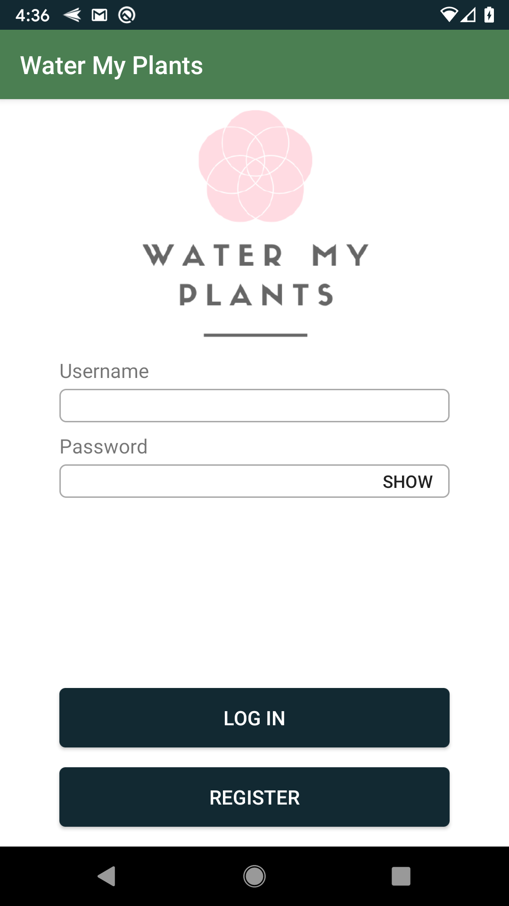
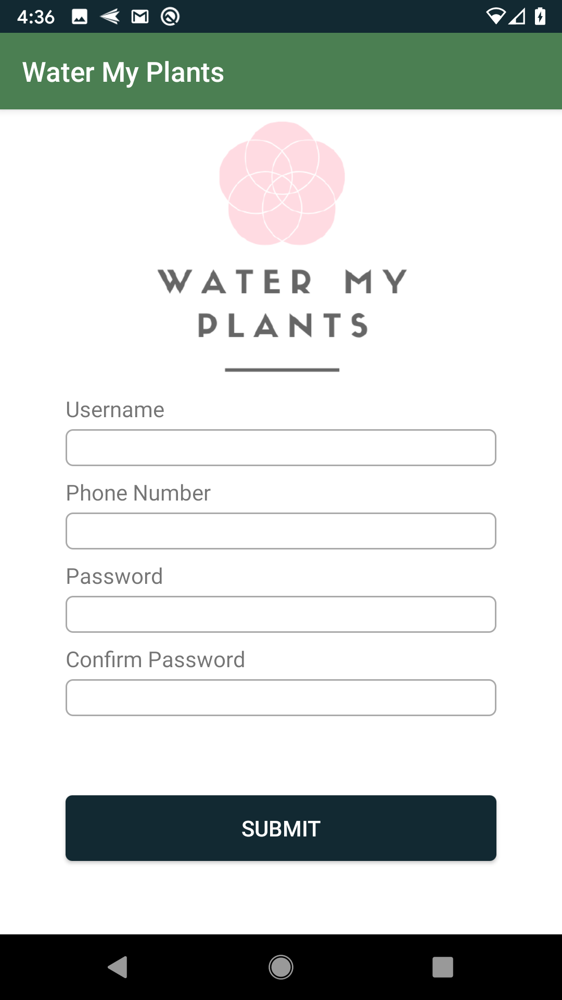
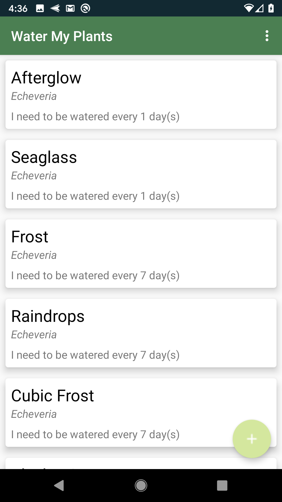
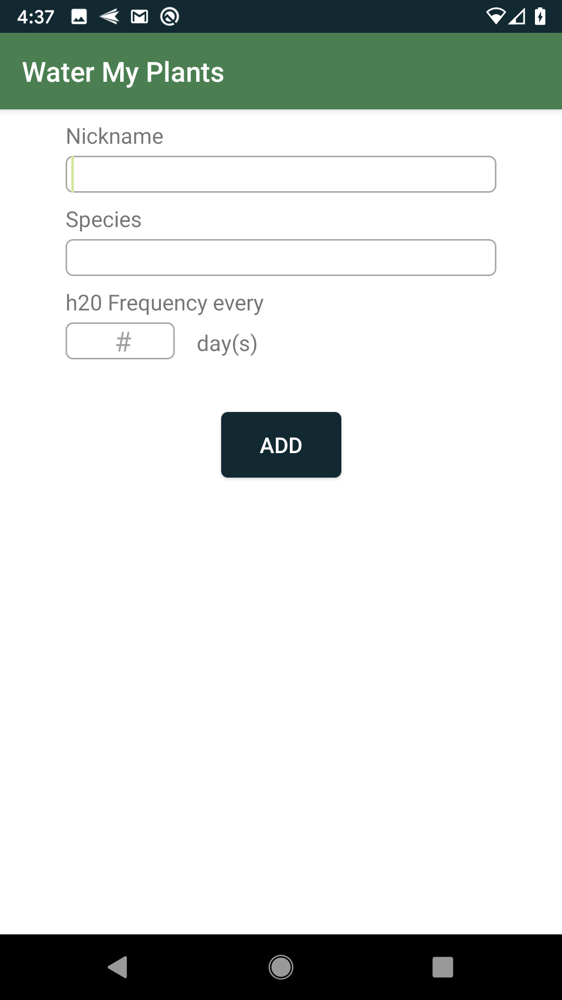
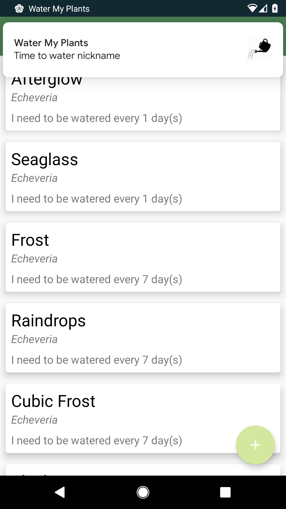
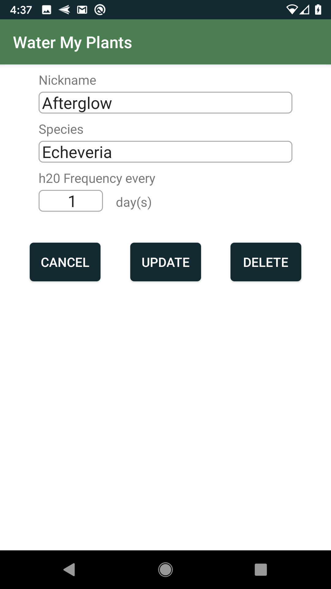
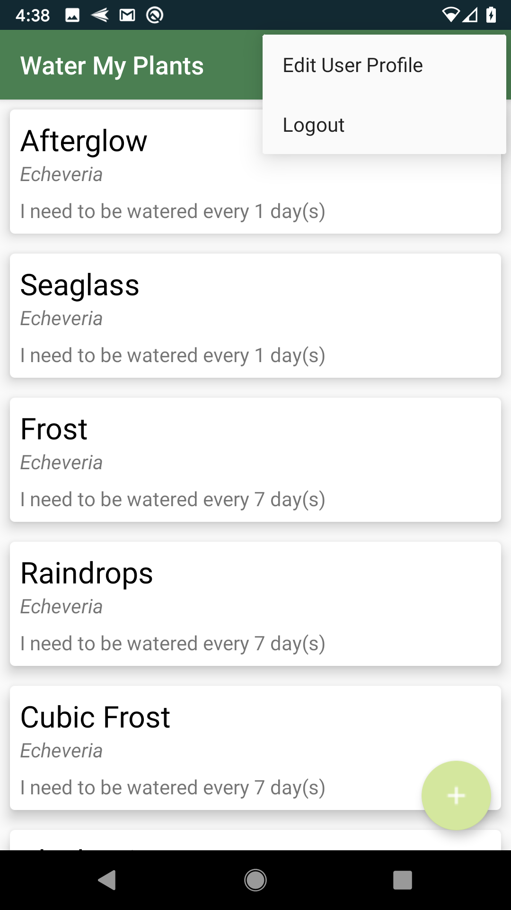
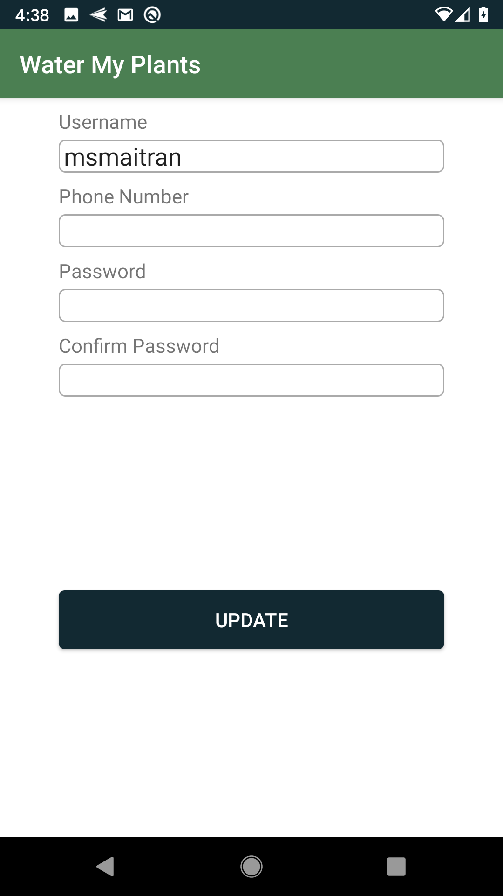

# Android: Water My Plants

Are you so busy or forgetful that you do not remember to water your plants? Create an account through Water My Plants, so that you could add your plant and set up a reminder of when to water it.

Water My Plants is a great app to help prevent your plants from dying from lack of water. Download it today and try it out!

## Login/Register Pages:
The user must login first. If the user does not have an account, they can click on the "Register" button. On the registration page, the user must create a username, enter a phone number, and a password. (Conductor/Controllers)

 

## Homepage:
The homepage shows a list of all the users plants that have been added (CardView/RecyclerView).

## Add Plant:
From the homepage, the user can add a plant by click on the floating action button.

## Notification:
After the user has created a plant entry, a notification will be set up.

## Update/Delete Plant:
The user also has the ability to update/delete a plant entry.

## Options Menu: Update Profile/Logout
From the homepage, the user can click on the options menu (top right) to either update their user profile or to logout from the app. 

 
